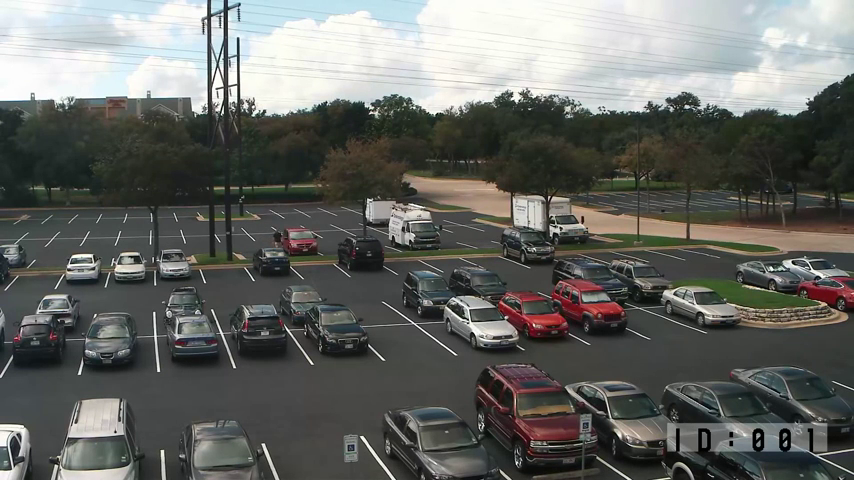
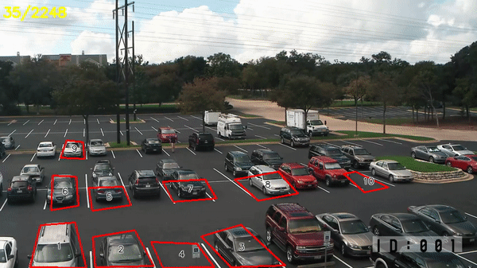

# smart-parking-space
Run detecting_coordinates.ipynb to detect coordinates in an image and it will save it in a coordinates.txt file

## After that run main.ipynb file to detect mean of the square space as specifies in the text file

